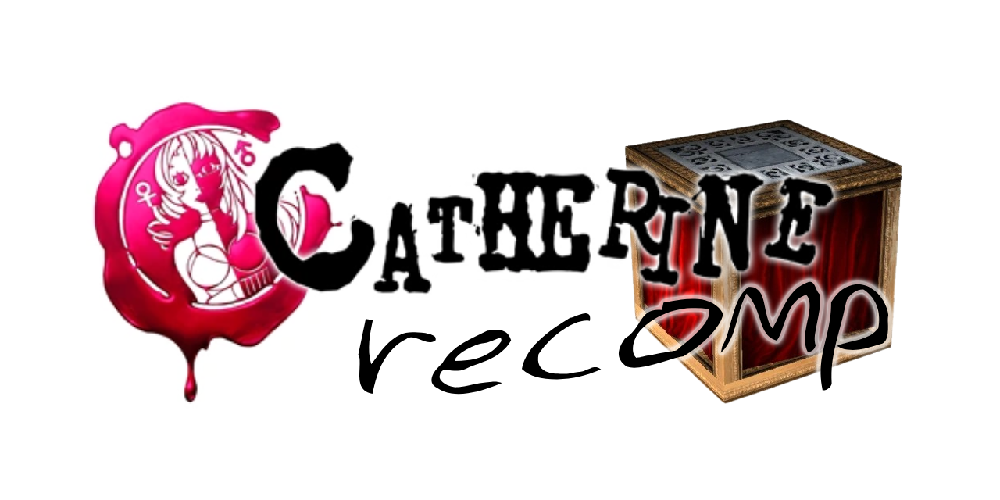
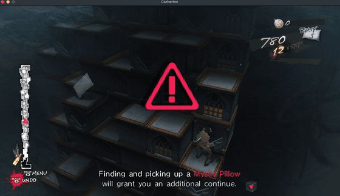
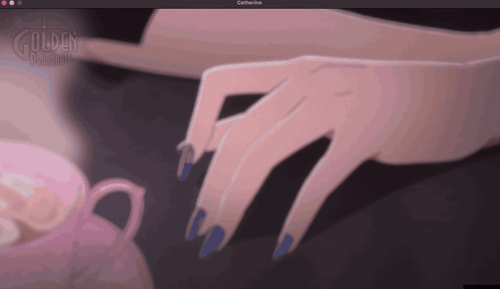
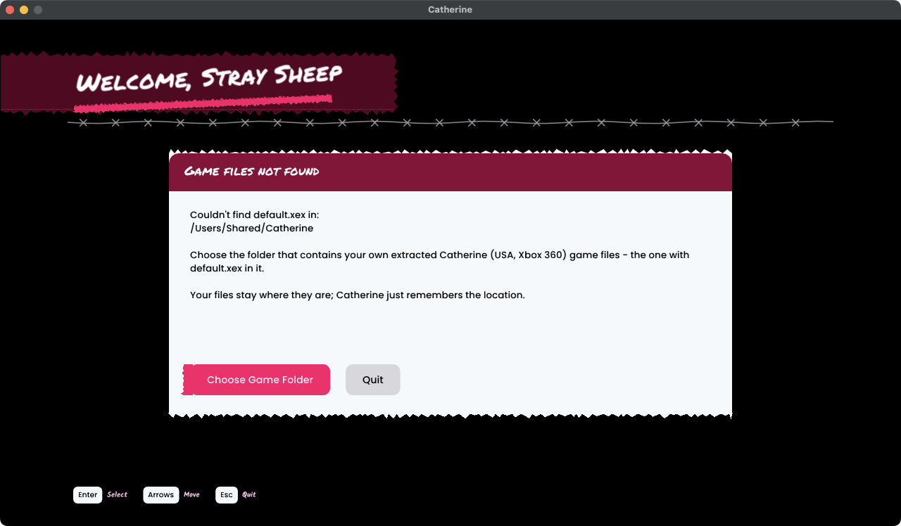
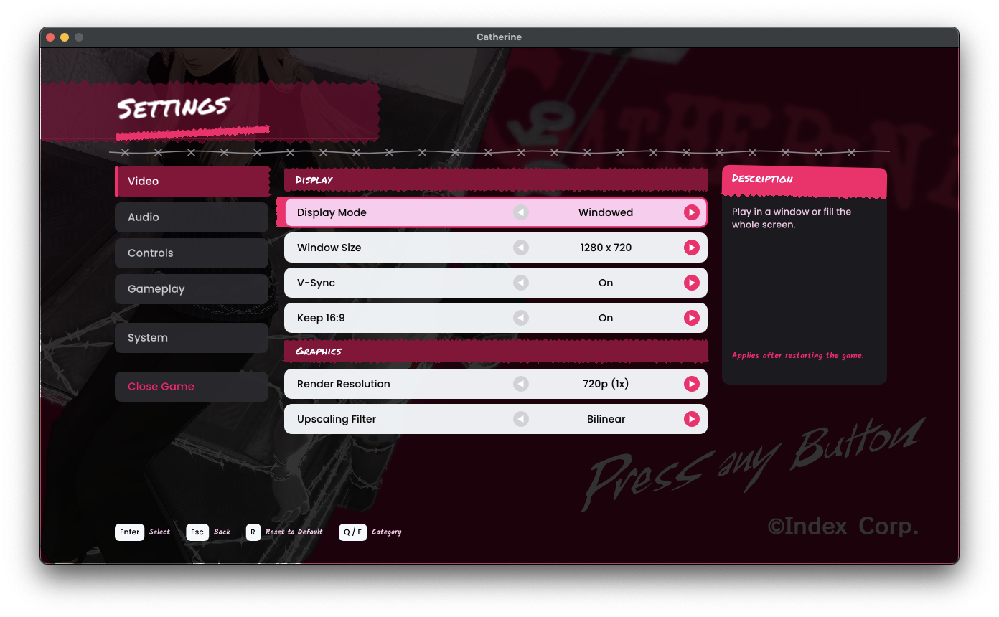

<p align="center"></p>
<p align="center"><i>A native Apple Silicon recompilation of Catherine (Atlus, 2011, Xbox 360)</i></p>

---

> **No game code or game data is included here.** You need your own copy of
> *Catherine* (USA, Xbox 360). The recompiled code is generated on **your** Mac,
> from **your** files, when you run the setup.

This project uses the [ReXGlue SDK](https://github.com/rexglue/rexglue-sdk) to
statically recompile the Xbox 360 executable into a native ARM64 macOS app,
with Xenos graphics translated to Metal (through Vulkan/MoltenVK).

## What you get

- **Catherine.app** — a normal Mac app, built on your machine.
- **A settings menu in the game's style** (press **Esc**, or **Back + Start** on
  a controller): display mode, window size, render resolution (up to 2160p),
  V-Sync, upscaling filter, audio options, controls, pause behaviour and more.
  The game pauses while it's open.
- **Fixes on top of the SDK**, including the black screen at gameplay start,
  keyboard support for in-game dialogs, a working pause, and much cleaner audio
  (removes decoder crackles and dropouts).
- Keyboard & mouse or any controller macOS supports.

## Screenshots

<table>
  <tr>
    <td align="center" width="50%"><br><sub>Gameplay (shown at 3&times; speed)</sub></td>
    <td align="center" width="50%"><br><sub>Cutscene (shown at 2&times; speed)</sub></td>
  </tr>
  <tr>
    <td align="center" width="50%"><br><sub>First-run setup screen</sub></td>
    <td align="center" width="50%"><br><sub>Settings menu (press Esc)</sub></td>
  </tr>
</table>

## Requirements

- An Apple Silicon Mac (M1 or newer), macOS 15 or later
- About 5 GB of free space
- [Homebrew](https://brew.sh) and Apple's Command Line Tools (setup offers to install what's missing)
- Your own extracted **Catherine (USA)** Xbox 360 game folder, containing `default.xex`
  (only this exact release is supported; setup checks it)

## Install

```sh
git clone https://github.com/ammocache/catherine-macos.git catherine-project/rex-retail
cd catherine-project/rex-retail
./setup.sh
```

`setup.sh` walks you through everything: it checks your Mac, downloads the
ReXGlue SDK (v0.10.0) and applies this project's fixes, asks for your game
folder and verifies it, recompiles the game (about 10 minutes on an M4 MacBook Pro, longer on older Macs) and
offers to put **Catherine.app** in your Applications folder.

Options: `./setup.sh --game /path/to/game/folder --yes` runs without questions.

If you move your game files later, Catherine shows a setup screen at launch and
lets you pick the new folder.

## Playing

| | Keyboard | Controller |
|---|---|---|
| Settings menu | Esc | Back + Start |
| Move | W A S D | Left stick |
| Camera | Arrow keys | Right stick |
| Confirm / Back | Space / Backspace | A / B |
| Pause (in game) | Enter or X | Start |

Settings are saved in `~/Library/Application Support/Catherine/catherine.toml`.

## Status

Playable: boots, menus, cutscenes and gameplay work, at a steady 30 fps on a
base M4 MacBook Pro (16 GB, macOS 15) at the original 720p. That is the only
hardware it has been tested on so far.

**Why 30 fps, and why not 60?** V1 targets a stable, V-Sync-locked 30 fps, the
speed the game was made for. Unlocking the frame rate is not just a setting: the
game's logic is expected to be tied to 30 fps timing (this is how many 360
games work, and is not yet verified in detail for Catherine), so 60 fps would
need game-logic fixes, as other recompilation projects have had to do.

Known issues:
- Switching display mode or window size applies after a restart
  (the menu has a *Restart Now* button).
- Higher render resolutions are GPU-heavy: 2x runs ~20 fps on a base M4. The
  cost comes from how the Xbox 360's EDRAM is emulated (many small render
  passes per frame), not from the shaders; details in
  [docs/PERFORMANCE_NOTES.md](docs/PERFORMANCE_NOTES.md).
- Faint outlines around some menu text, occasional HUD glitch bars.
- A little low-frequency audio roughness can remain.

## Roadmap

- Cut the cost of the emulated render-target passes so 2x runs at a stable 30 fps.
- Investigate a ground-up native renderer (no EDRAM emulation, Xenos shaders
  converted ahead of time, as in Unleashed Recompiled's
  [XenosRecomp](https://github.com/hedge-dev/XenosRecomp)) for higher
  resolutions. This is exploratory and a large amount of work; there is no
  promise or date for it.
- Game-logic fixes for frame rates above 30 fps.
- More menu polish (FPS counter, volume slider, key remapping, popup styling).

## How it works

1. The ReXGlue code generator translates the game's PowerPC code into C++
   (`generated/`, created on your machine and never committed).
2. That code is compiled together with the ReXGlue runtime (kernel, audio,
   input, and the Xenos→Vulkan graphics backend) into a native app.
3. `patches/` holds this project's fixes to the SDK; `src/` holds the app
   (settings menu, setup screen, defaults).

## Credits & licenses

This project's own code (settings menu, setup screen, scripts, patches) is
released under the [MIT License](LICENSE). The license does not cover the game
or the icon, banner, screenshots and clips, which use ATLUS / SEGA material.

- [ReXGlue SDK](https://github.com/rexglue/rexglue-sdk) (BSD 3-Clause), which builds on [Xenia](https://xenia.jp).
- Fonts: Permanent Marker (Apache 2.0), Kalam, Poppins, Nunito (SIL OFL 1.1) — see `assets/fonts/`.
- App icon: an image of the curtain block from *Catherine*, © ATLUS / SEGA, used
  here as a fan-project icon only. It is not covered by this project's license.
- Banner: made by the project author using artwork from *Catherine*, © ATLUS / SEGA, used
  here as fan-project artwork only. It is not covered by this project's license.
- Screenshots and clips: captured from this project running on a Mac; the game's visuals are
  © ATLUS / SEGA, shown here to illustrate the fan project. Not covered by this project's license.
- See [THIRD_PARTY_NOTICES.md](THIRD_PARTY_NOTICES.md).

*Catherine* is © ATLUS / SEGA. This is an unofficial fan project, not affiliated
with or endorsed by Atlus or SEGA. It does not include or distribute any of
their code, art, audio or other assets.
